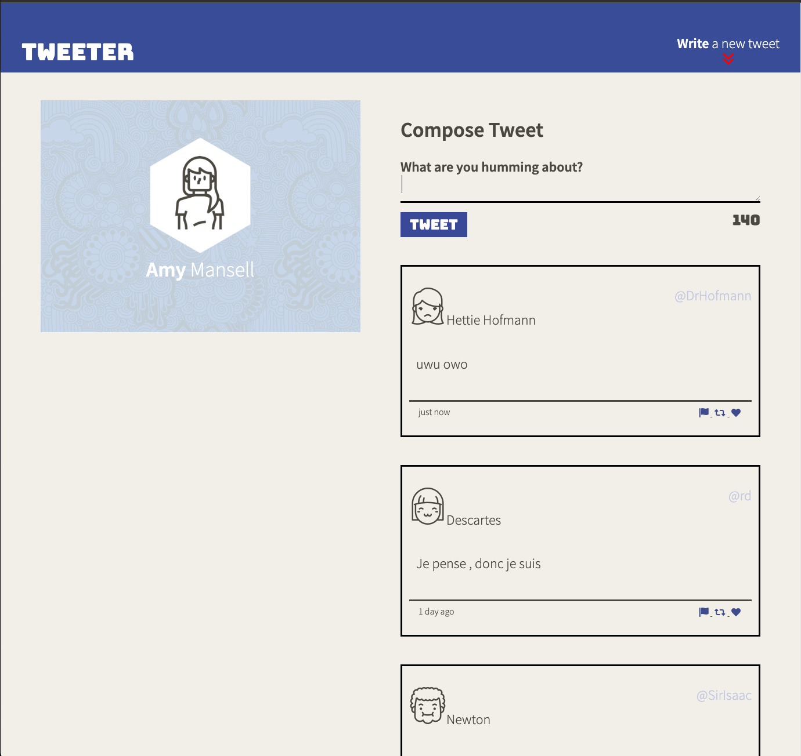
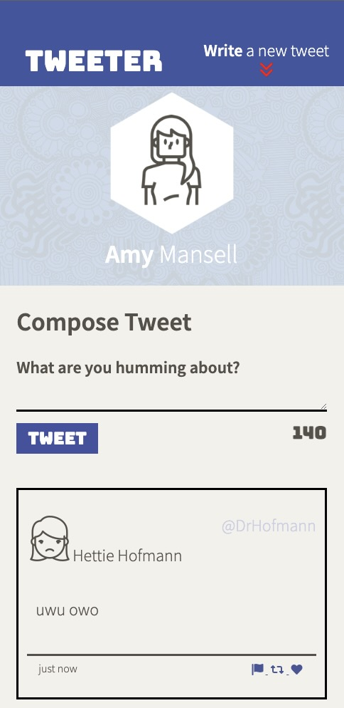

# Tweeter Project

Tweeter is a simple, single-page Twitter clone.

This single page application was designed by Justin Diaz during week 4 of Lighthouse labs' web development bootcamp. Creating this page required usage of HTML, CSS, Javascript and JQuery. Stringing together Jquery methods had a learning curve during development, but reading through the docs to piece it together improved my skills as a developer.

 As it currently stands this SPA makes asynchronous requests for tweets to the back-end. When it recieves tweets it will render a new tweet template for all tweet recieved. 

 This page is both mobile and desktop friendly!

# Screenshots

#### Desktop View

#### Mobile View

## Getting Started

1. [Create](https://docs.github.com/en/repositories/creating-and-managing-repositories/creating-a-repository-from-a-template) a new repository using this repository as a template.
2. Clone your repository onto your local device.
3. Install dependencies using the `npm install` command.
3. Start the web server using the `npm run local` command. The app will be served at <http://localhost:8080/>.
4. Go to <http://localhost:8080/> in your browser.

## Dependencies

- Express
- Node 5.10.x or above
